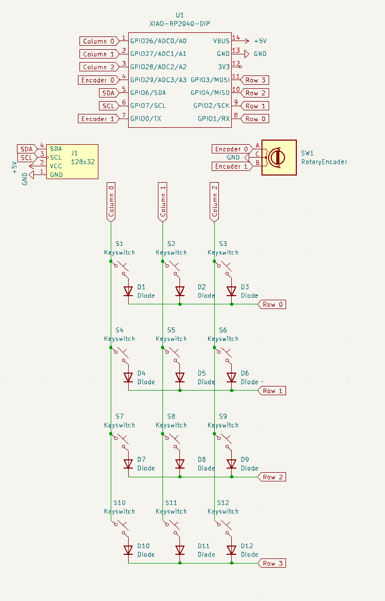
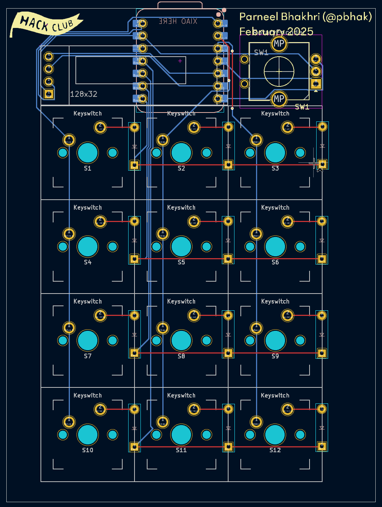
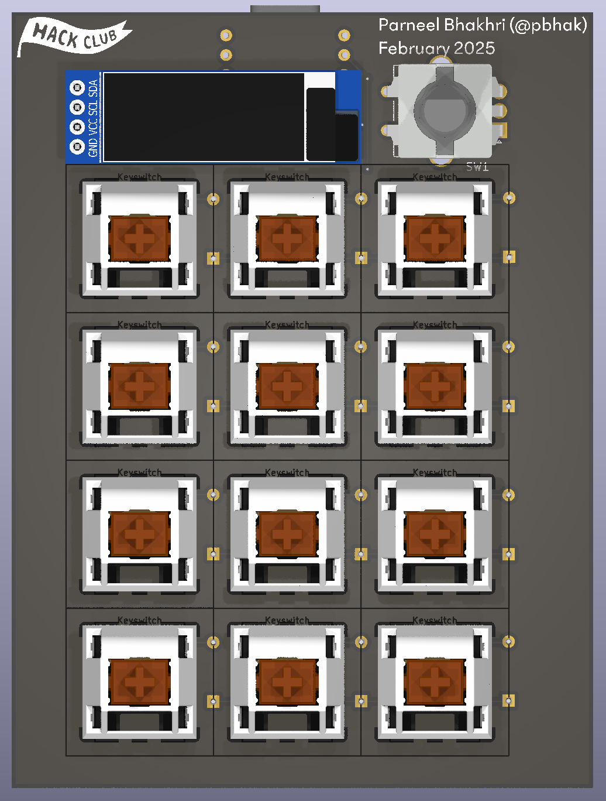
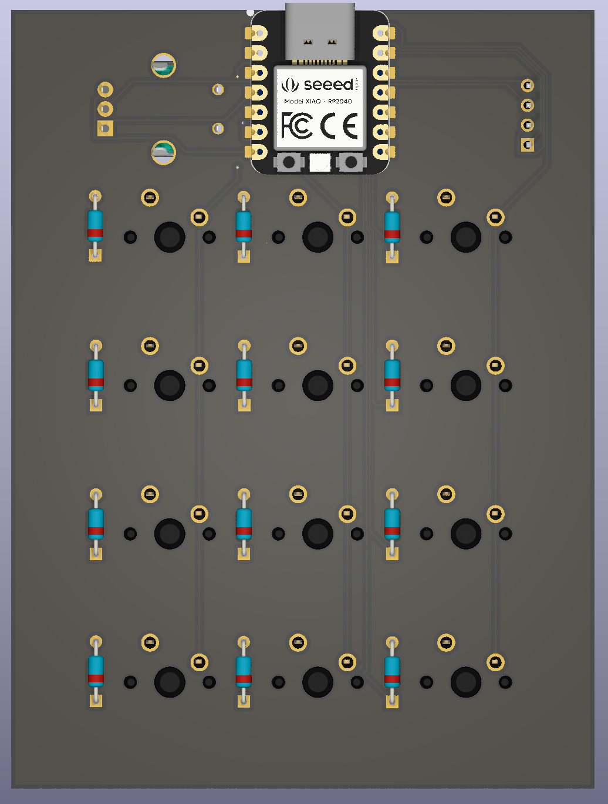
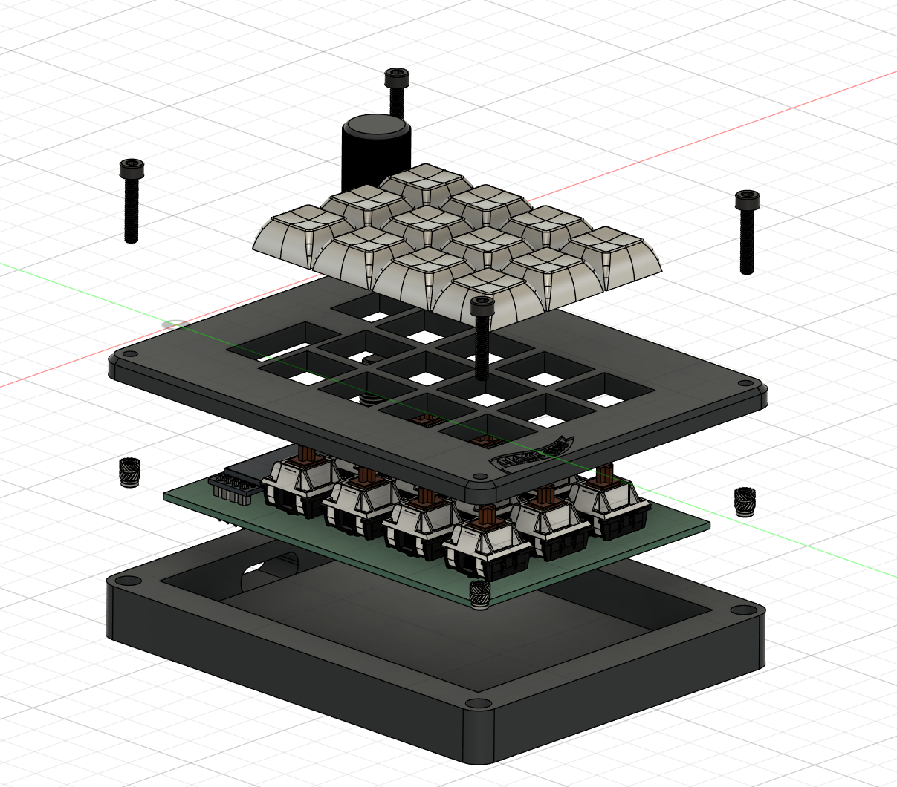
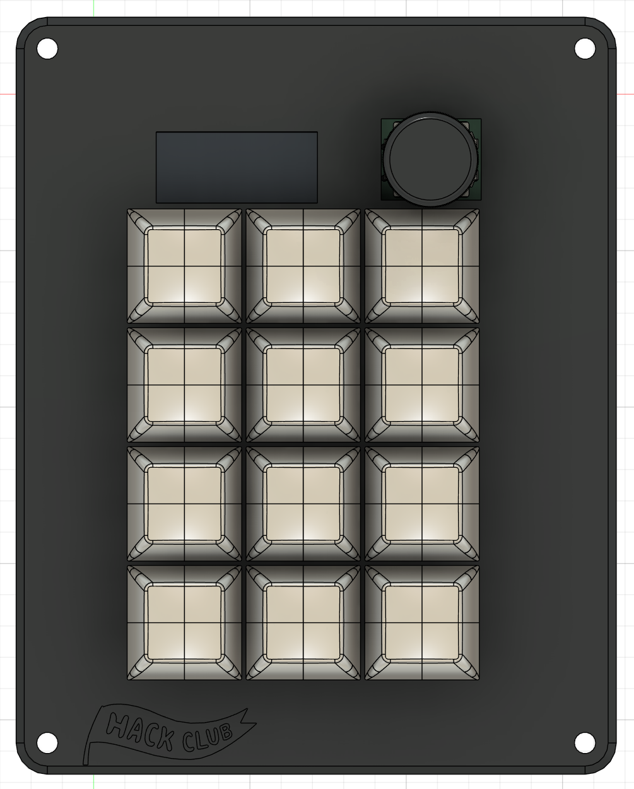
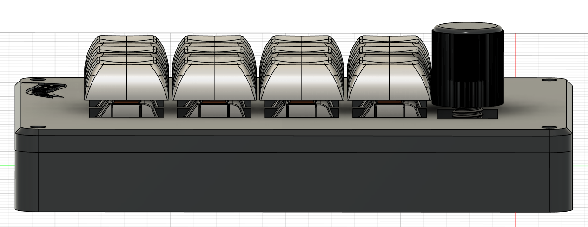
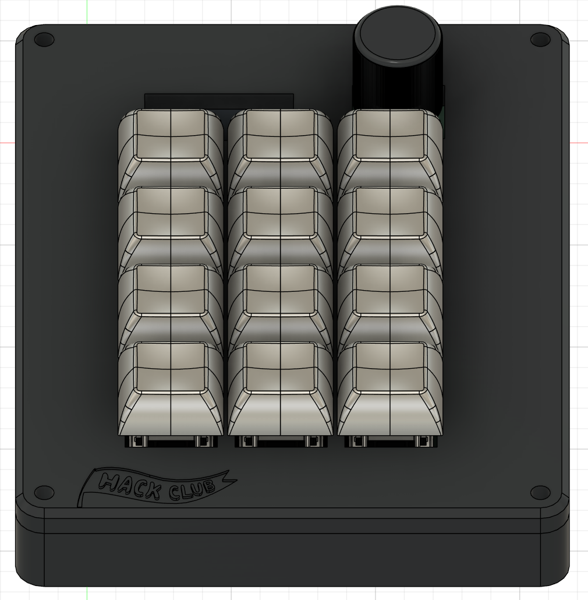

# Parneel's Hackpad
My Hackpad, designed for IDE functionality and general-purpose stuff

## Screenshots
### PCB

*PCB schematic* \

*PCB* \

*PCB, rendered front side* \

*PCB, rendered back side* \

### Case

*Top view* \

*Side view* \

*Other side view* \

## BOM
| Component                | Qty | Comments                                                                                                                 |
|--------------------------|-----|--------------------------------------------------------------------------------------------------------------------------|
| XIAO RP2040              | 1   |                                                                                                                          |
| EC11 Rotary Encoder      | 1   |                                                                                                                          |
| Cherry MX-style switches | 12  | will be ordering [custom switches](https://divinikey.com/products/gateron-smoothie-linear-switches) w/ grant if possible |
| 1N4148 diodes            | 12  |                                                                                                                          |
| 0.91" SSD1306 OLED       | 1   |                                                                                                                          |
| 1U Keycaps                  | 12  | preferably mostly white with a few red/black ones                                                                        |
| M3x16 screws             | 4   |                                                                                                                          |
| M3 heat-set inserts      | 4   |                                                                                                                          |
| Case.stl                 | 1   | black if possible                                                                                                        |
| Plate.stl                | 1   | black if possible                                                                                                        |
| Knob.stl                 | 1   | black if possible                                                                                                        |
| PCB                      | 1   |          